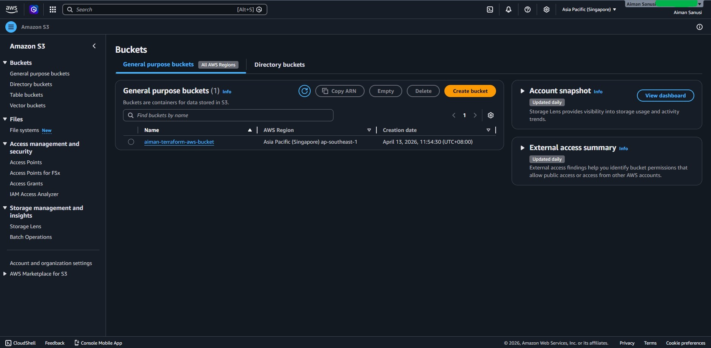
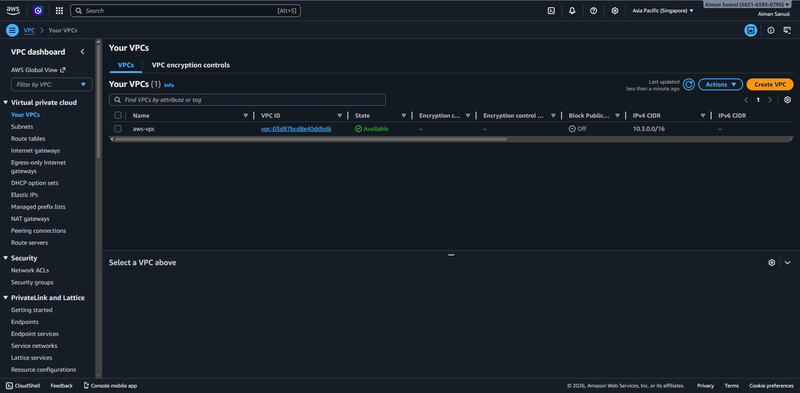

# Terraform Infrastructure Lab

[](https://github.com/Morbid-TRX/terraform-lab/actions/workflows/drift-check.yml)

A production-grade, multi-environment cloud infrastructure project built with Terraform and LocalStack — featuring automated drift detection, smart remediation, security scanning, cost estimation, and real-time Slack alerting via a fully automated CI/CD pipeline.

## What This Project Does

Provisions AWS-compatible infrastructure across isolated dev, prod, local, and real AWS environments using reusable Terraform modules. A Python-based drift detection system monitors infrastructure state continuously, alerts via Slack with source tracking, and triggers smart remediation — automatically on schedule, manually with approval on push.

## Infrastructure Provisioned

- **VPC** — isolated private network per environment
- **Subnet** — public subnet within each VPC
- **Security Group** — hardened ingress/egress rules (tfsec validated)
- **S3 Bucket** — encrypted, versioned, public-access blocked object storage

## Environment Structure

| Environment | VPC CIDR | Bucket | Target |
|---|---|---|---|
| local | 10.0.0.0/16 | my-terraform-bucket | LocalStack |
| dev | 10.1.0.0/16 | dev-terraform-bucket | LocalStack |
| prod | 10.2.0.0/16 | prod-terraform-bucket | LocalStack |
| aws | 10.3.0.0/16 | aiman-terraform-aws-bucket | Real AWS |

## Tools & Technologies

- **Terraform** — Infrastructure as Code
- **LocalStack** — local AWS cloud emulator (via Docker)
- **Python** — drift detection, simulation, and alerting scripts
- **Docker** — container runtime for LocalStack
- **GitHub Actions** — CI/CD pipeline for automated drift checks and remediation
- **tfsec** — Terraform security misconfiguration scanner
- **Infracost** — cloud cost estimation integrated into CI pipeline
- **Slack** — real-time alerts for drift, remediation, cost, and failures
- **pre-commit** — automated code quality hooks on every commit
- **Git** — version control with branch protection rules

## Project Structure

```
terraform-lab/
├── .github/
│   └── workflows/
│       ├── drift-check.yml       # CI pipeline - runs on push and daily schedule
│       └── remediate.yml         # Manual approval remediation workflow
├── environments/
│   ├── local/
│   │   ├── main.tf               # local environment config
│   │   ├── variables.tf          # input variables
│   │   └── outputs.tf            # resource outputs
│   ├── dev/
│   │   └── main.tf               # dev environment config
│   ├── prod/
│   │   └── main.tf               # prod environment config
│   └── aws/
│       └── main.tf               # real AWS environment config
├── modules/
│   └── compute/
│       ├── main.tf               # reusable infrastructure module
│       └── variables.tf          # module input variables
├── screenshots/
│   ├── AWS_S3_Bucket_Terraform.jpg
│   └── AWS_VPC_Terraform.jpg
├── drift_detector.py             # scans for infrastructure drift + Slack alerts
├── drift_simulator.py            # simulates out-of-band infrastructure changes
├── .pre-commit-config.yaml       # pre-commit hooks for code quality
├── .gitignore
└── README.md
```

## CI/CD Pipeline

Every push to `main` and daily at 8:00 AM UTC triggers the full pipeline:

1. 💰 **Infracost** — estimates monthly AWS cost
2. 🔒 **tfsec** — scans Terraform for security misconfigurations
3. ☁️ **LocalStack** — spins up local AWS environment
4. 🏗️ **Terraform Init + Apply** — provisions infrastructure
5. 🔍 **Drift Detector** — checks for state mismatches
6. 🔧 **Auto Remediation** — applies automatically on scheduled runs only
7. 📢 **Slack Alert** — notifies with status, source, cost, and timestamp

## Smart Remediation

| Trigger | Remediation |
|---|---|
| Scheduled (daily 8AM UTC) | Auto-remediate immediately |
| Push to main | Require manual approval via GitHub Actions |
| Manual workflow dispatch | Require manual approval via GitHub Actions |

## Slack Alerts

The system sends real-time Slack notifications for:
- ✅ Clean state — no drift detected
- 🚨 Drift detected — with list of changes and remediation link
- 🔧 Remediation complete — with trigger source and estimated cost
- 💸 Cost threshold exceeded — when estimated cost exceeds $10/month
- ❌ Pipeline failure — with direct link to the failed run

All alerts include **source tracking** (Local Machine vs GitHub Actions) and **Malaysia Time (MYT)** timestamps.

## AWS Deployment Validation

The same Terraform module was successfully deployed to **real AWS** (ap-southeast-1, Singapore) with zero code modifications — validating true cloud portability.

Resources provisioned on AWS:
- VPC (`10.3.0.0/16`) — ap-southeast-1
- Subnet — ap-southeast-1a
- S3 Bucket (`aiman-terraform-aws-bucket`) — ap-southeast-1

> Infrastructure was provisioned and verified on AWS Free Tier, then destroyed to avoid charges.

### Proof of Deployment

**S3 Bucket on AWS:**


**VPC on AWS:**


## Security

- **tfsec** scans run automatically on every push
- Security group rules restricted to VPC CIDR only (no public ingress)
- S3 bucket hardened with encryption, versioning, and public access blocking
- Branch protection rules enforce PR reviews and passing CI before merge
- Pre-commit hooks block malformed or insecure code before it reaches GitHub

## State Management

Terraform state is managed locally by default. For production team use, an S3 backend configuration is included (commented out) in each environment:

```hcl
# backend "s3" {
#   bucket         = "your-terraform-state-bucket"
#   key            = "environments/local/terraform.tfstate"
#   region         = "ap-southeast-1"
#   encrypt        = true
#   dynamodb_table = "terraform-state-lock"
# }
```

## How to Run

### Prerequisites
- Docker Desktop
- Terraform
- Python 3.x
- LocalStack account (free tier)
- AWS account (free tier, optional)

### 1. Start LocalStack
```bash
docker run -d -p 4566:4566 -p 4510-4559:4510-4559 \
  --name localstack \
  -e LOCALSTACK_AUTH_TOKEN=your_token \
  localstack/localstack
```

### 2. Provision an Environment
```bash
cd environments/local   # or dev, prod
terraform init
terraform apply
```

**For real AWS deployment:**
```bash
cd environments/aws
terraform init
terraform apply
terraform destroy  # always destroy after to avoid charges
```

### 3. Run Drift Detection
```bash
export SLACK_WEBHOOK_URL=your_webhook_url
python drift_detector.py
```

### 4. Simulate Drift
```bash
python drift_simulator.py           # breaks infra
python drift_detector.py            # catches it
python drift_simulator.py restore   # restores clean state
```

### 5. Install Pre-commit Hooks
```bash
pip install pre-commit
pre-commit install
```

## Key Concepts Demonstrated

- Multi-environment Infrastructure as Code with reusable Terraform modules
- Parameterized infrastructure using variables and outputs
- Local cloud emulation for cost-free development and testing
- Automated drift detection mimicking enterprise SRE workflows
- Smart remediation — automatic on schedule, manual approval on push
- Security scanning with tfsec and hardened resource configurations
- Cost visibility with Infracost integrated into CI pipeline
- Real-time Slack alerting with source tracking and MYT timestamps
- Branch protection and pre-commit hooks for code quality enforcement
- State management with S3 backend configuration for team collaboration
- CI/CD pipeline integration with GitHub Actions
- Validated on real AWS Free Tier with zero code modifications
